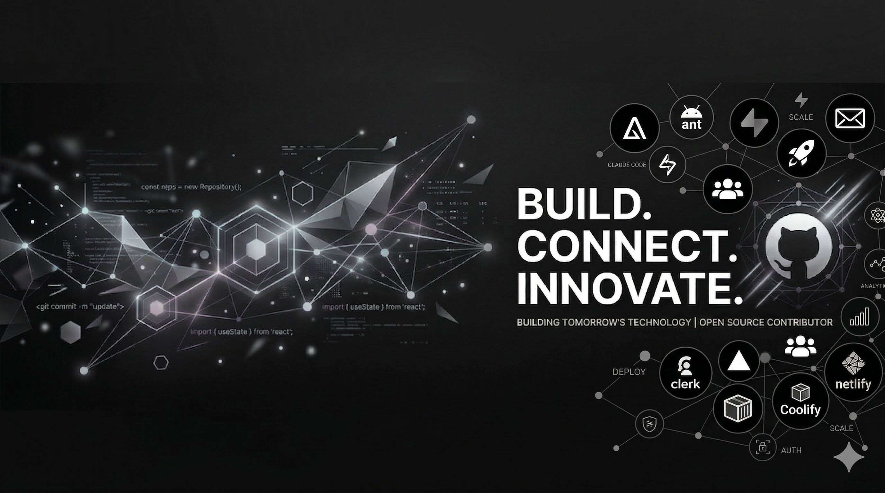

<p align="center">
  
</p>

<br/>

<div align="center">

<h1>BJANDCO</h1>

<p><code>Creative Strategist &nbsp;·&nbsp; Marketing Strategist &nbsp;·&nbsp; AI Builder &nbsp;·&nbsp; Digital Architect &nbsp;·&nbsp; Est. 2015</code></p>

<br/>

[](https://git.io/typing-svg)

<br/><br/>

[](mailto:youremail@example.com)
[](https://linkedin.com)
[](https://thebjandco.com)
[](https://github.com/blairjand)

</div>

---

## `$ whoami`

I am a **Creative Strategist and AI-augmented builder** — operating at the intersection of brand thinking, precise engineering, and intelligent systems.

Since **2015**, I have engineered **50+ production applications** spanning real estate, legal, hospitality, energy, fitness, retail, and SaaS — deployed across **8 countries**. My workflow fluidly bridges strategy, high-end design, and robust code, ensuring the brand narrative inherently informs the digital architecture.

**Claude Code** and **Cursor** form the core of my build environment. They serve as profound force multipliers that allow me to ship with unprecedented velocity while maintaining rigorous production discipline at every layer.

> *I don't just build websites and apps.*
> *I architect the digital infrastructure that businesses compete on.*

- **AI-Augmented Execution** — Claude Code + Cursor for a 10× shipping velocity without compromising technical excellence.
- **Strategic Clarity** — Brand positioning and targeted user journeys meticulously defined before a single line of code is written.
- **Security-First Architecture** — Proactive CVE patching, HSTS, and hardened API routes standard on all production deployments.
- **Native Search Authority** — Comprehensive SEO, AEO, and GEO seamlessly woven into the foundation.
- **Deep Observability** — Granular tracking and telemetry via GA4, Vercel Analytics, and PostHog.

---

## `$ cat stack.config`

### AI & Build Tools


### Development Environment


### Frontend


### Backend & Runtime


### Database & BaaS


### CMS & Content


### Auth & Identity


### Payments


### Email & Comms


### Infrastructure & Deployment


### CDN & Edge


### Security


### Analytics & Observability


### Search & Discoverability


### Design & No-Code


### Automation & Integrations


### E-commerce


### Testing & Quality


---

## `$ cat approach.md`

```yaml
# How I work

status: "Available upon request"
message: "If you want to know how I work, email me."
contact: "mailto:youremail@example.com"
```

---

## `$ git log`

<div align="center">


&nbsp;


<br/><br/>


<br/><br/>


</div>

---

## `$ echo $PHILOSOPHY`

```
┌─────────────────────────────────────────────────────────┐
│                                                         │
│   "Nothing is impossible. The best digital experience   │
│    is invisible, and the smartest strategy always       │
│    feels like common sense. In the age of AI, we no     │
│    longer limit ourselves by what is feasible to        │
│    build—we are limited only by our imagination."       │
│                                                         │
│                           —           THEBJANDCO        │
│                                                         │
└─────────────────────────────────────────────────────────┘
```

---

<div align="center">

*50+ projects · 8 countries · most of the work is private · all of the craft is not.*

<br/>

[](mailto:youremail@example.com)

<br/><br/>

[](https://github.com/topics/readme-generator)

</div>


